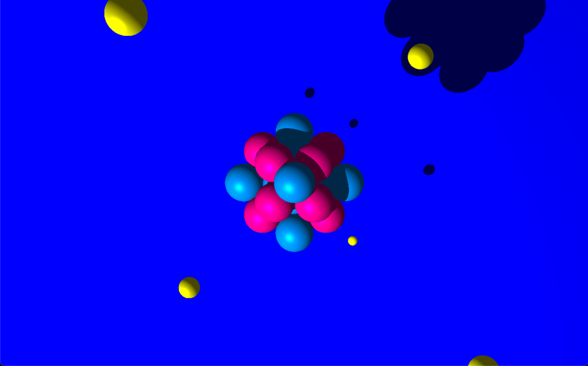
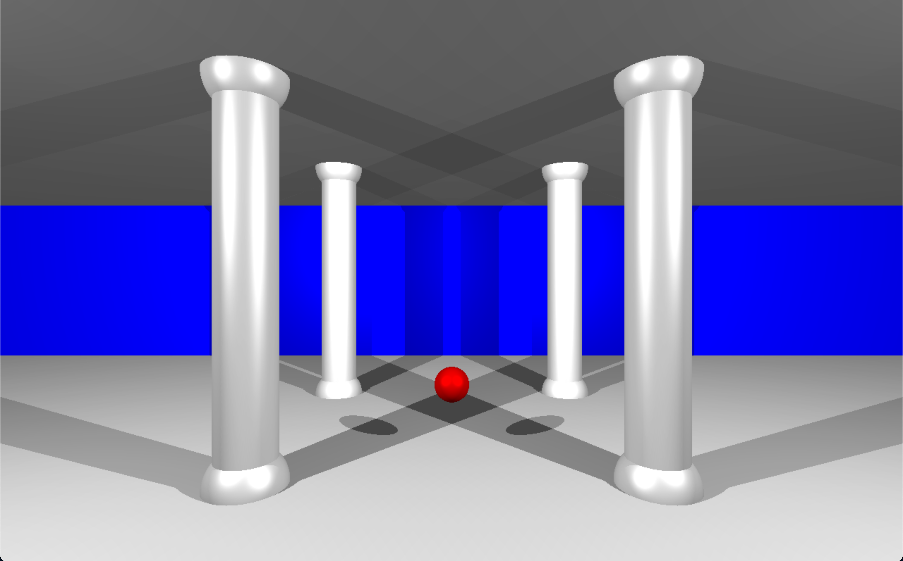

# MiniRT - 42 Project

This is one of my favorite projects so far at 42! It implements a simple ray tracer based on the Phong reflection model. The ray tracer can handle basic shapes such as **cylinders**, **spheres**, and **planes**, and it also supports **hard shadows**.

## Features

- Phong reflection model for realistic lighting
- Supports rendering of cylinders, spheres, and planes and multiple, colorful spot lights
- Hard shadows

## How to Run

1. Clone the repository:
   
   git clone https://github.com/pisakbori/miniRT.git
   
2. Build the project:
   
make bonus

3. Run the program with a scene, for example:

./miniRT ./images/atom.rt

